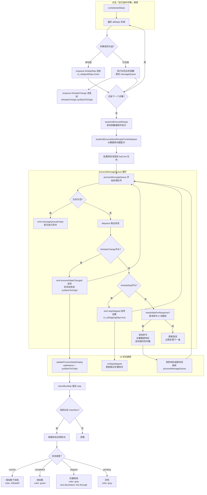

# 步骤变色状态流程图

## 完整流程

## 流程说明

| 阶段 | 关键函数/信号 | 作用 |
|------|--------------|------|
| 点击执行 | `runSelectedSteps` | 遍历 allSteps，勾选的执行并 enqueue `AAstateChange`，未勾选的 enqueue `AAskipStep` |
| 队列处理 | `processMessageQueue` | 循环从队列取消息，AA 命令特殊处理，设备命令走发送→等待响应→继续 |
| 状态变更 | `emit processStateChanged(stateName)` | `AAstateChange:xxx` 触发，更新 UI 显示正在执行第 xxx 步 |
| 样式渲染 | `updateProcessStateDisplay(stateName)` | checkBoxMap 查找 stateName 对应 checkbox，按 current/completed/skipped/pending 应用样式 |

## 样式渲染规则

优先级（从高到低）：

1. **skipped**（已跳过）→ `color: gray; text-decoration: line-through;`
2. **current**（正在执行）→ `color: #00aa00; font-weight: bold; text-decoration: underline;`
3. **completed**（已完成）→ `color: green; font-weight: bold;`
4. **pending**（已勾选未执行）→ `color: gray;`
5. **unselected**（未勾选）→ `color: gray; text-decoration: line-through;`

## checkBoxMap 映射关系

| stateName | 对应 checkbox | 备注 |
|-----------|--------------|------|
| `reset` | `m_processCheckBox_reset` | 0.复位 |
| `xyzBackToOrigin` | `m_processCheckBox_xyzBackToOrigin` | 1.xyz回到原点 |
| `xyzBackToOrigin` | `m_processCheckBox_resetXYZ` | 4.xyz回到原点（QMap重复key，后者覆盖前者） |
| `takeEmptyBottle` | `m_processCheckBox_takeEmptyBottle` | 2.打开空瓶 |
| `getSolid` | `m_processCheckBox_getSolid` | 3.取出固体 |
| `getLiquid` | `m_processCheckBox_getLiquid` | 5.取液体 |
| `capBottleAndTransferToShaker` | `m_processCheckBox_tightenBottle` | 6.拧好瓶子去摇床 |

## 业务函数与 AAstateChange 对应

| 业务函数 | 发送的 AAstateChange | 效果 |
|---------|---------------------|------|
| `initializeAllDevices` | `AAstateChange:reset` | position 0 变绿 |
| `resetXYZMotorsToZero` | `AAstateChange:xyzBackToOrigin` | position 1/4 变绿 |
| `takeEmptyBottle` | 无 | 无变色 |
| `getSolid` | 无 | 无变色 |
| `getLiquid` | 无 | 无变色 |
| `capBottleAndTransferToShaker` | 无 | 无变色 |

> 注：只有发送了 `AAstateChange` 的步骤才会触发 UI 变色。目前 `initializeAllDevices` 和 `resetXYZMotorsToZero` 有发送，其他步骤（takeEmptyBottle/getSolid/getLiquid/capBottleAndTransferToShaker）不发送，因此勾选这些步骤时不会有绿色加粗的"正在运行"效果。
