# 高通量钙钛矿药物配方制备系统 — 运行逻辑文档

## 一、系统总览

本系统是一套工业自动化控制软件，驱动机械臂、天平、摇床等硬件，自动完成钙钛矿前驱体溶液的配制。软件采用**事件驱动 + 异步命令队列**架构：上层业务逻辑将操作步骤拆分为命令序列写入队列，底层通信模块按顺序逐条发送并等待硬件响应，全程非阻塞，界面始终保持响应。

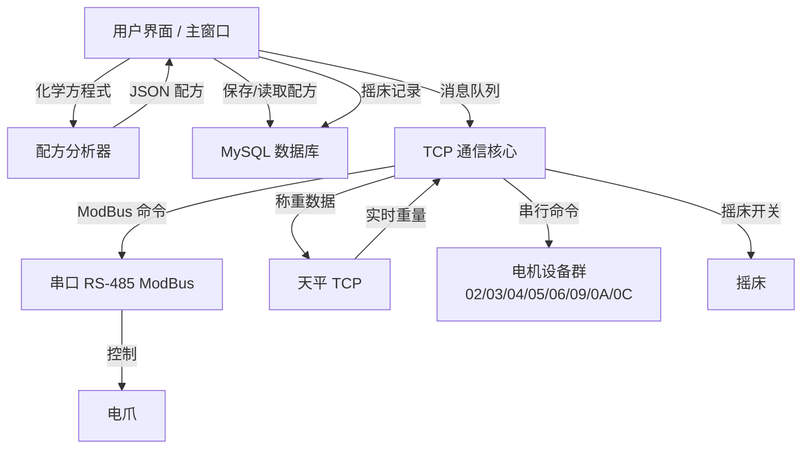

---

## 二、模块列表

| 模块 | 职责 |
|------|------|
| 主窗口 | 用户交互、配方调度、业务流程编排 |
| TCP 通信核心 | 命令队列处理、设备通信、电机轮询、天平称重 |
| 数据库 | MySQL 连接管理、配方持久化、摇床记录 |
| 串口通信 | RS-485 ModBus 协议，驱动电爪等设备 |
| 配方分析器 | 化学方程式解析、前驱体用量计算 |
| 试剂箱 | 15 槽位置管理，记录当前存货 |

---

## 三、主窗口模块

### 3.1 启动初始化

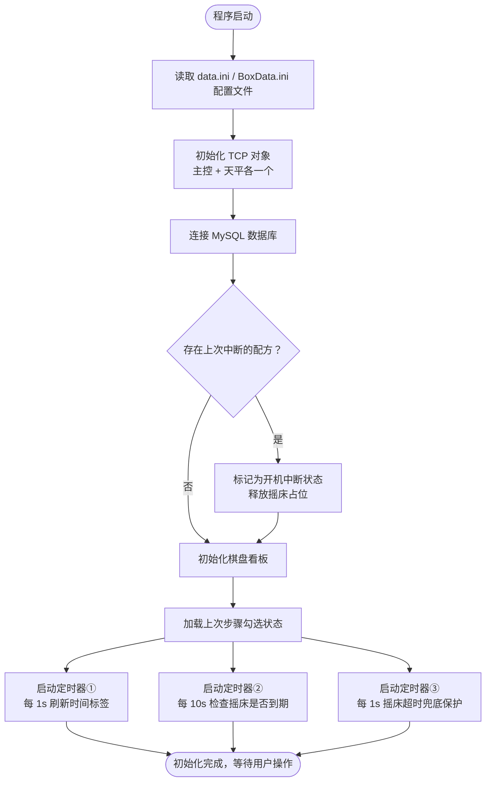

### 3.2 配方创建与排队

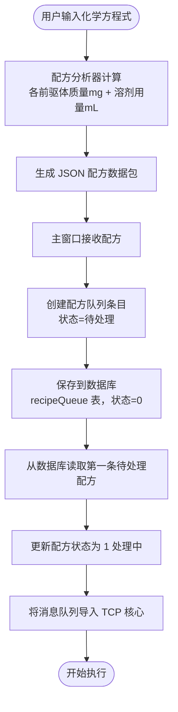

### 3.3 步骤选择与消息队列构建

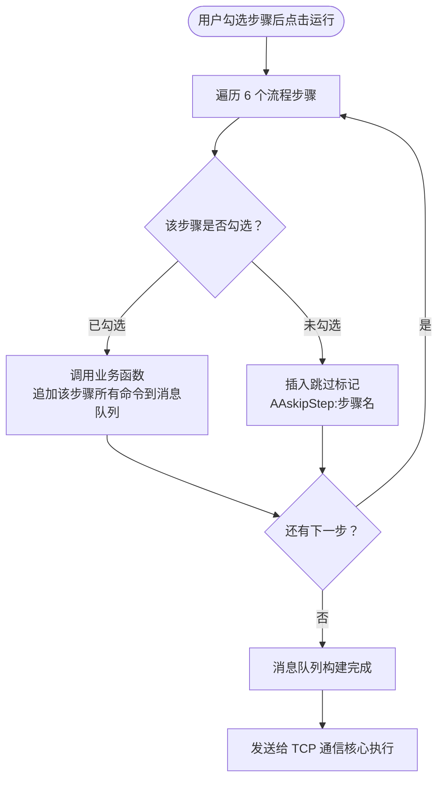

**取固体步骤举例：**

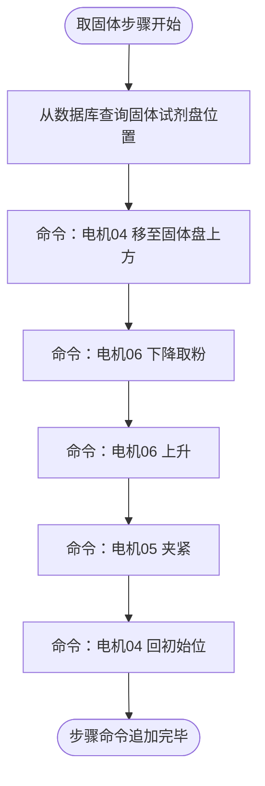

### 3.4 流程状态显示

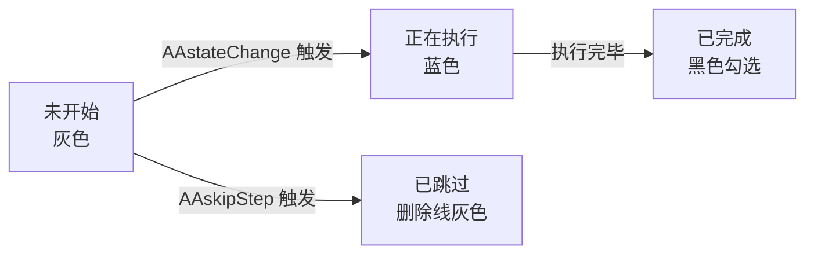

### 3.5 紧急暂停

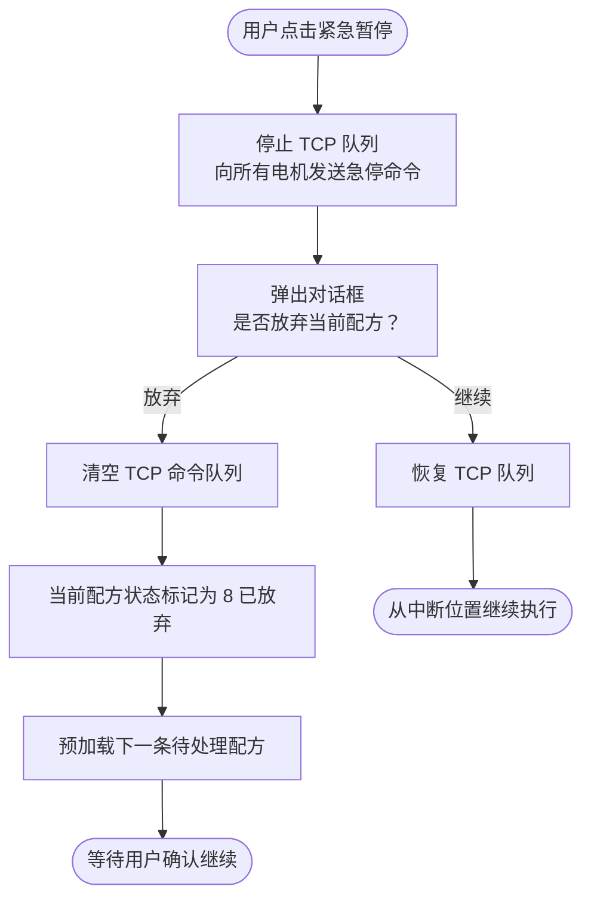

### 3.6 摇床管理

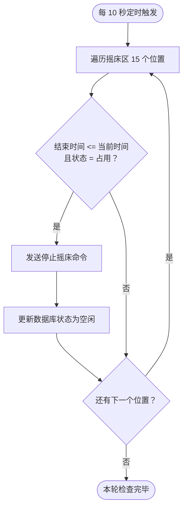

---

## 四、TCP 通信核心模块

这是整个系统的"心脏"，所有与硬件的通信都经过此模块。

### 4.1 命令队列结构

每条命令记录四个字段：

```
┌──────────────┬───────────────────────────────────┐
│ 内容          │ 待发送的字节（如 ">06D0001E240XXXX"） │
│ 格式          │ ASCII 文本 或 十六进制字节流           │
│ 是否等待响应  │ true = 发送后必须等到响应才继续         │
│ 期望响应      │ 收到的数据里必须包含的特征串（如 "06d"） │
└──────────────┴───────────────────────────────────┘
```

### 4.2 队列处理主循环（每 40ms 执行一次）

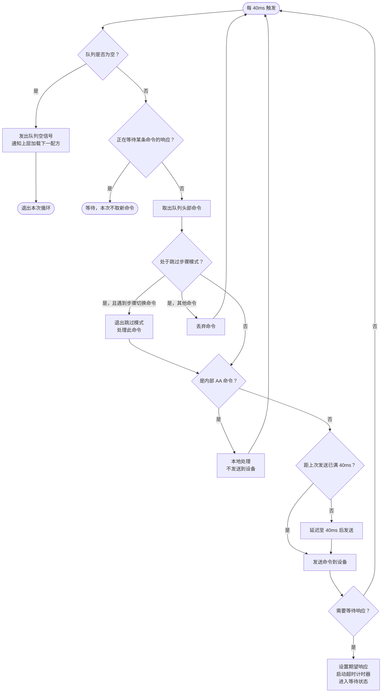

### 4.3 电机轮询机制

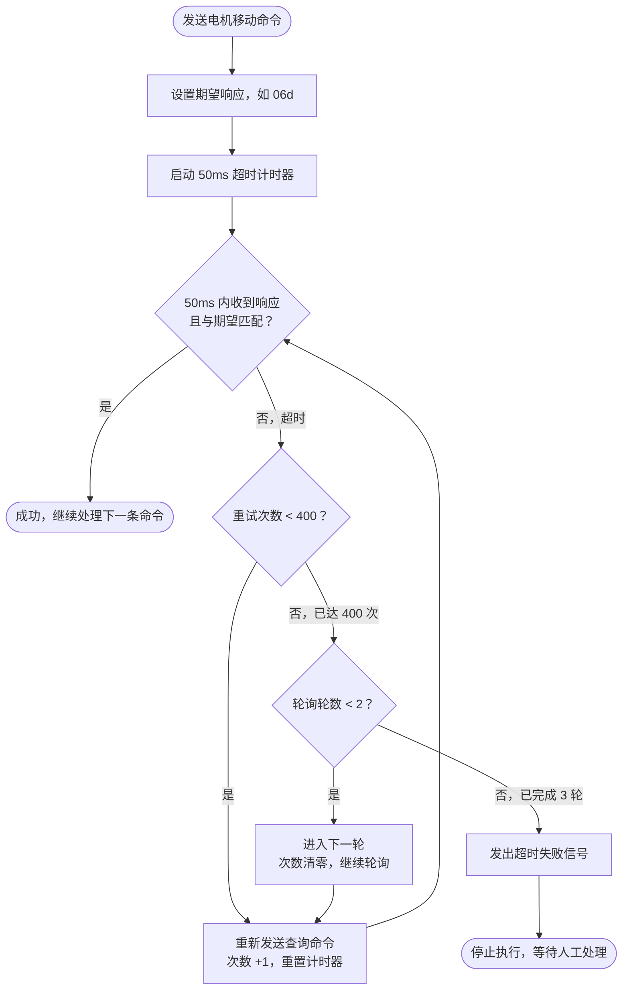

> 普通命令：超时间隔 90ms，最大重试 300 次（约 27 秒），只有 1 轮。

### 4.4 内部 AA 命令处理

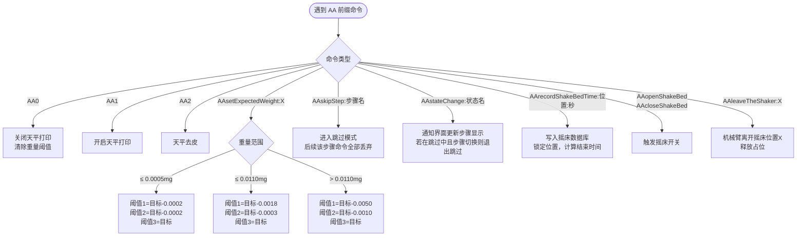

### 4.5 天平称重机制

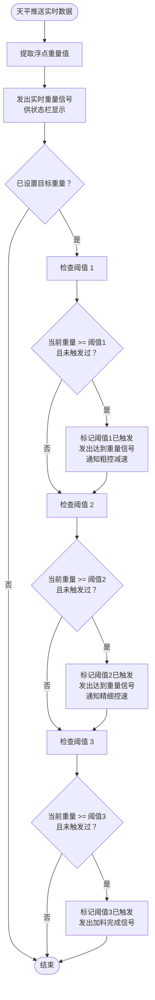

### 4.6 TCP 连接管理

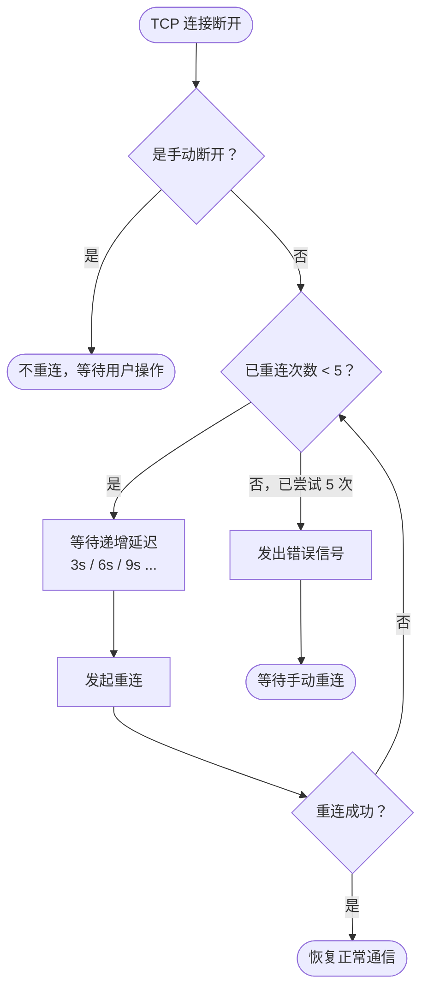

---

## 五、数据库模块

### 5.1 连接方式

通过 ODBC 驱动连接 MySQL（192.168.10.170:3306），数据库名 PhenoLabHT。

每 10 秒执行一次轻量查询验证连接真实可用性。连接状态用彩灯在界面上显示。

### 5.2 配方生命周期状态流转

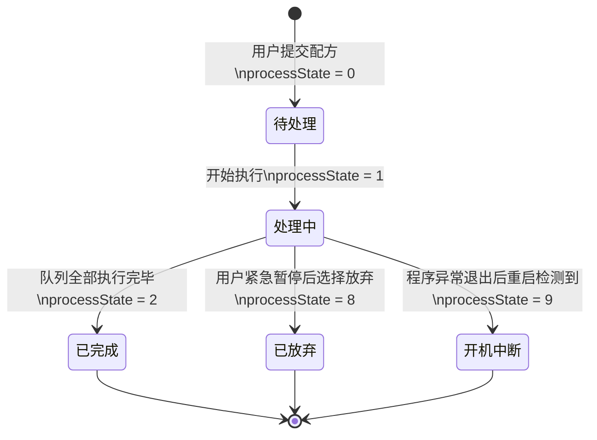

### 5.3 关键数据读写时机

| 时机 | 操作 |
|------|------|
| 配方创建 | 保存配方信息和消息队列到数据库 |
| 开始执行配方 | 更新配方状态为 1（处理中） |
| 配方完成 | 更新配方状态为 2（已完成） |
| 配方放弃 | 更新配方状态为 8（已放弃） |
| 程序启动时发现遗留处理中配方 | 更新状态为 9（开机中断） |
| 处理 AArecordShakeBedTime | 写入摇床开始时间、结束时间、占用状态 |
| 摇床到时停止 | 更新摇床状态为空闲 |

### 5.4 主要数据表

```
recipeQueue              配方队列（名称、状态、创建时间）
recipeMessageQueue       配方消息队列（每条操作命令）
shakeBedArea             摇床区域（15 个位置，各自的时间和占用状态）
pan_init                 试剂盘初始位置参数
pan_EmptyBottlePosition  空瓶位置
pan_FinishedProductLocation  成品位置
emptyBottleArea          取瓶区状态（当前取瓶计数）
```

---

## 六、串口通信模块（RS-485 / ModBus）

用于驱动电爪等通过 ModBus RTU 协议控制的设备。


串口参数：8 数据位、无校验、1 停止位、无流控。心跳检测：每 1 秒一次。

---

## 七、配方分析器模块

### 7.1 输入

- 化学方程式（如 `FAI:MAI:PbI2 = 1:1:2`）
- 摩尔浓度（mol/L）
- 目标体积（mL）
- 溶剂及比例（如 DMF 70% + DMSO 30%）

### 7.2 计算流程

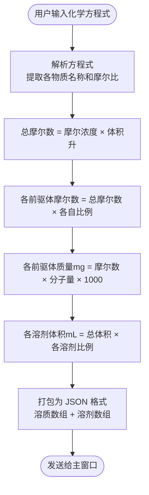

---

## 八、完整配方执行时间轴

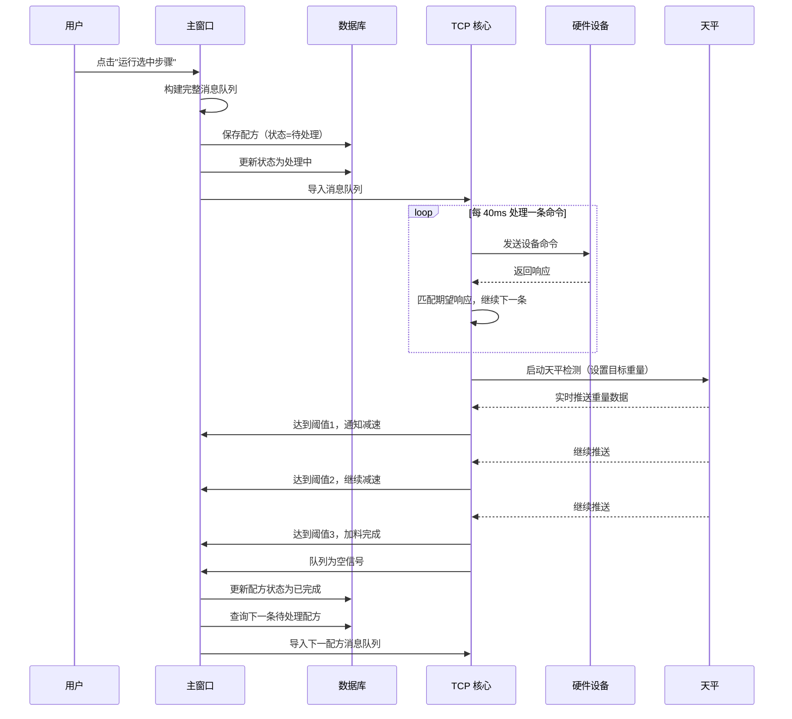

---

## 九、关键同步机制

### 9.1 命令串行保证

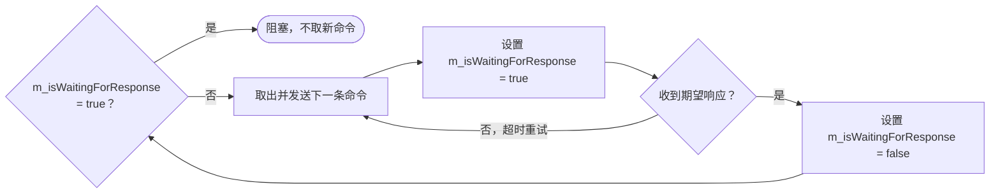

### 9.2 配方串行加载


### 9.3 天平称重去重

每个阈值只触发一次（用触发标记数组记录），防止因天平数据抖动导致重复发信号。

---

## 十、错误处理策略

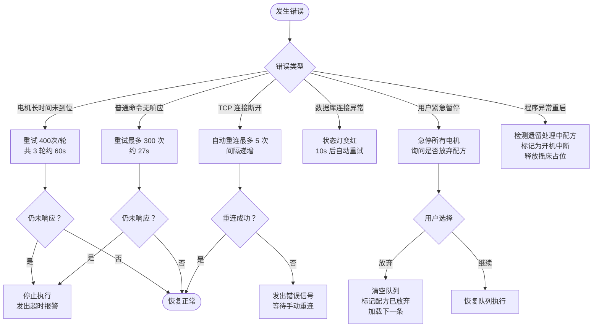
