# 高通量钙钛矿药物配方制备系统 — 详细运行逻辑（产品经理版）

> **阅读指引**：本文档以产品经理视角编写，每一章对应一个运行阶段，所有分支与异常情况均体现在 Mermaid 流程图中。你可以按章节顺序跟着流程图逐步模拟程序的完整运行过程。

---

## 系统模块总览

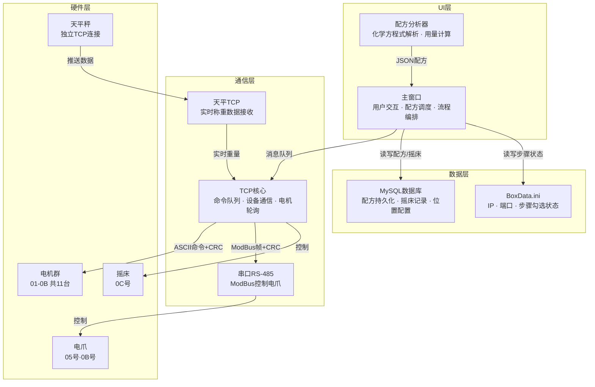

---

## 第一章：程序启动

### 1.1 构造函数初始化顺序

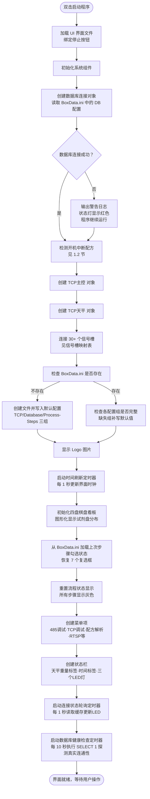

### 1.2 开机中断配方检测

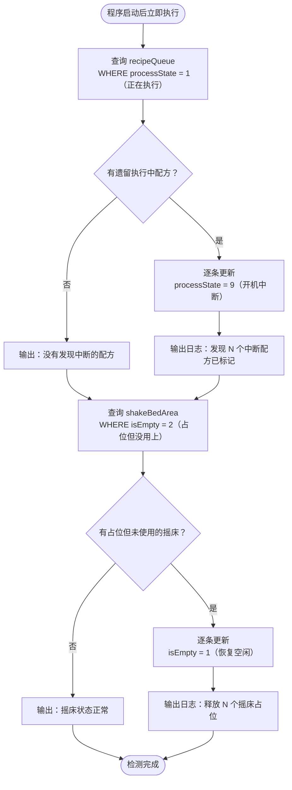

### 1.3 五个定时器职责

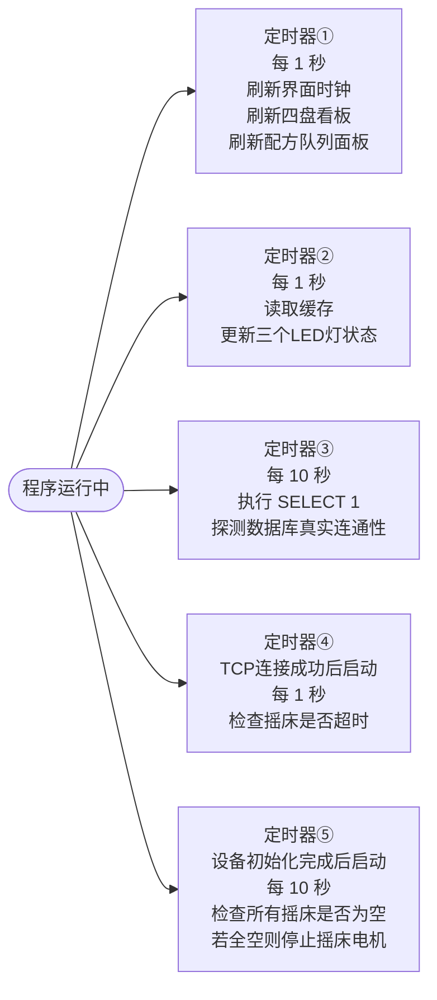

---

## 第二章：TCP 连接与设备初始化

### 2.1 点击连接按钮的完整流程

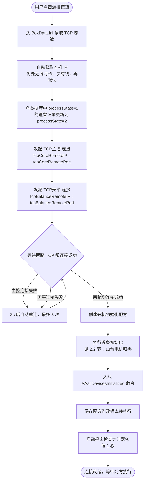

### 2.2 设备初始化：13台电机归零序列

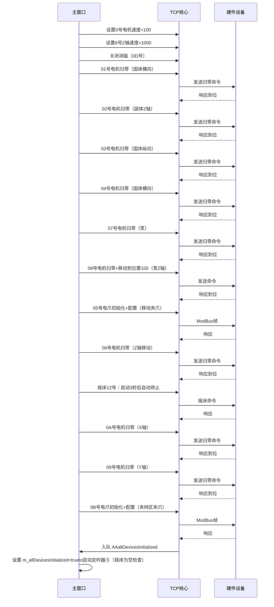

### 2.3 TCP 断线自动重连

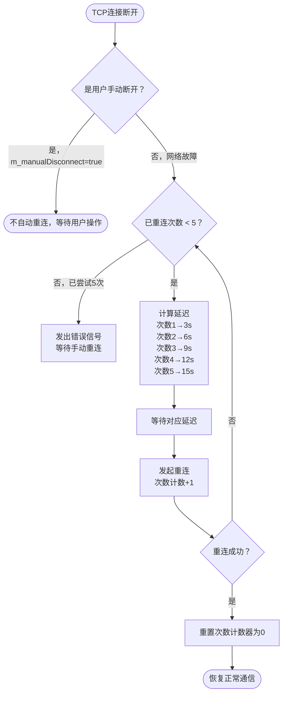

---

## 第三章：配方创建与队列管理

### 3.1 配方分析器计算流程

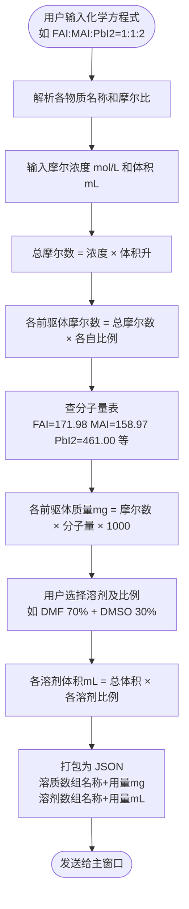

### 3.2 配方从输入到执行

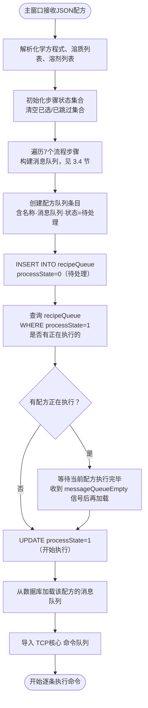

### 3.3 配方状态机

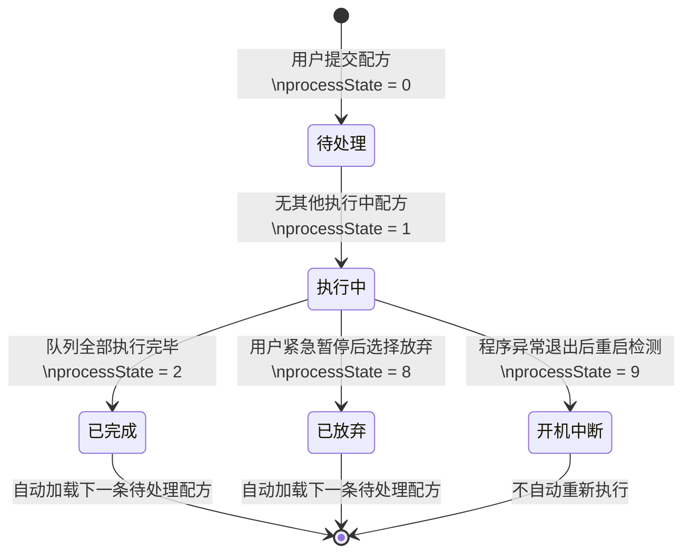

### 3.4 消息队列构建：7步骤勾选逻辑

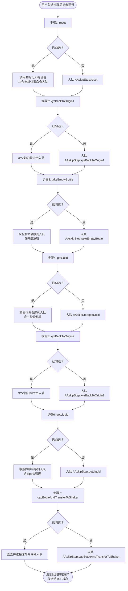

---

## 第四章：TCP 命令队列核心引擎

### 4.1 队列处理主循环（每 40ms 触发一次）

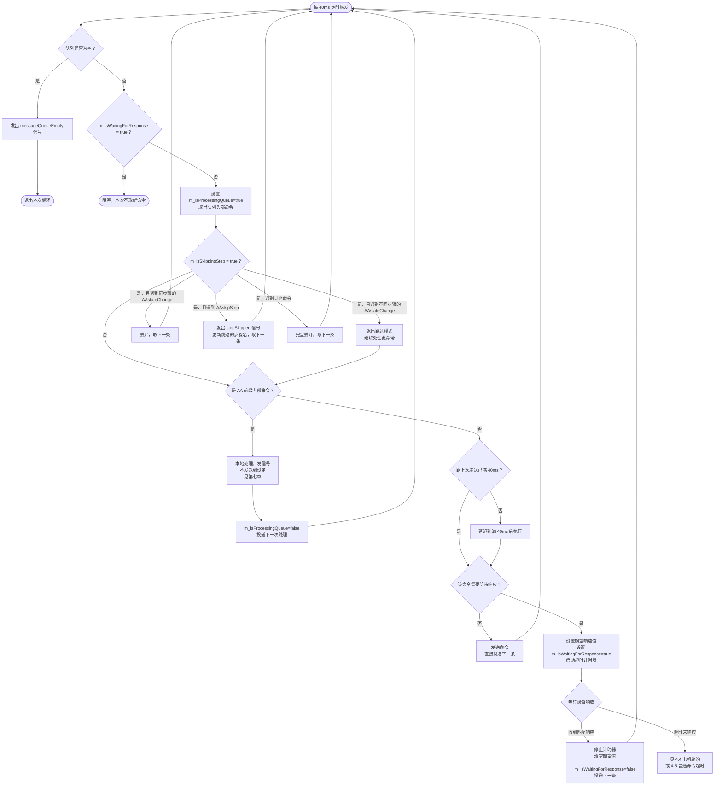

### 4.2 命令发送前 10 层检查链

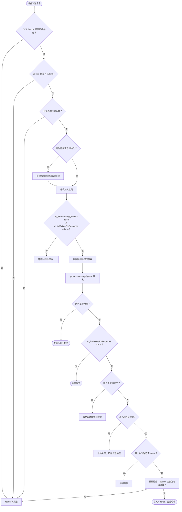

### 4.3 响应匹配规则

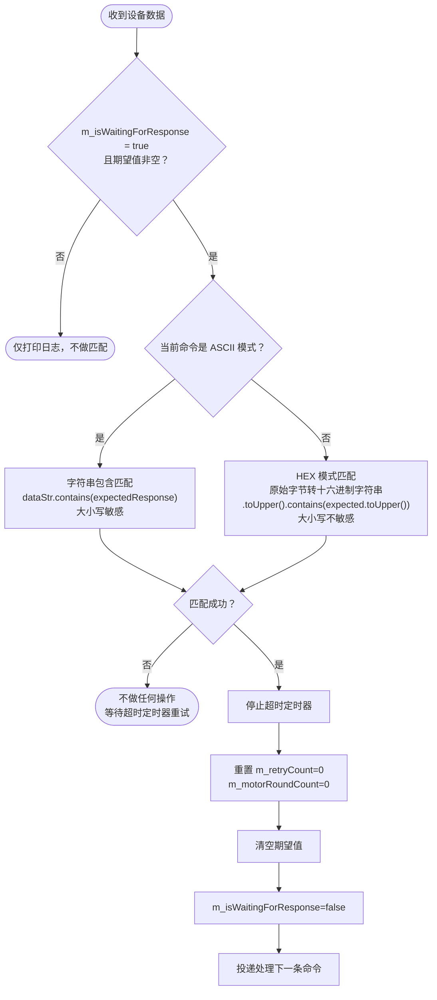

### 4.4 电机轮询：3 轮 × 400 次 × 50ms

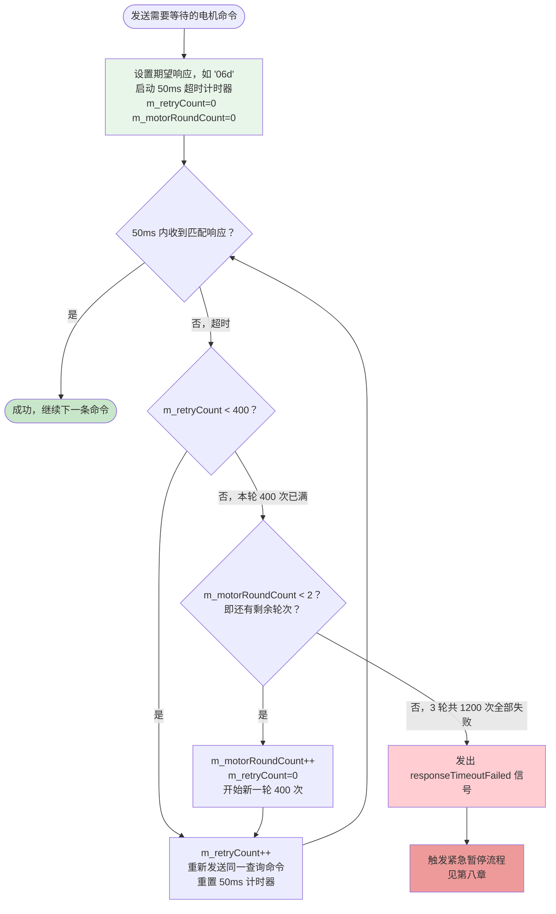

> 总等待时长：3 轮 × 400 次 × 50ms = **60 秒**

### 4.5 普通命令超时：300 次 × 90ms

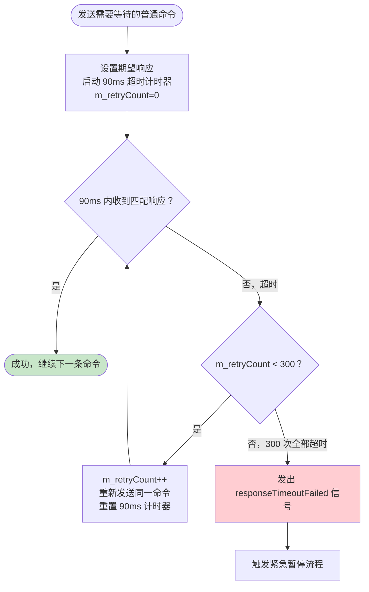

> 总等待时长：300 次 × 90ms = **约 27 秒**

### 4.6 跳过步骤模式状态机

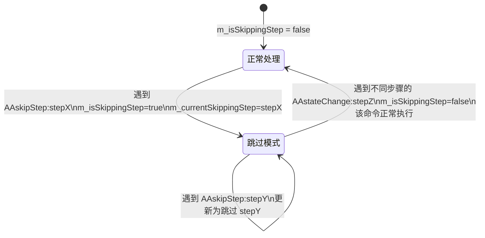

### 4.7 暂停与恢复队列的内部状态

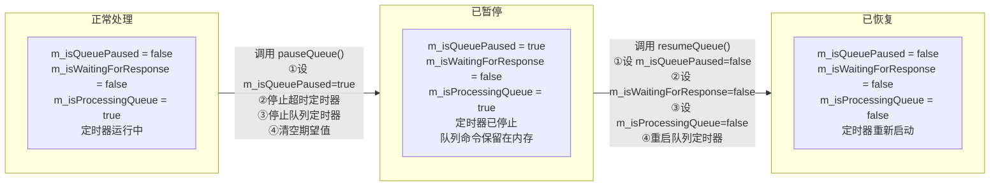

---

## 第五章：七大流程步骤详解

### 5.1 步骤一：reset（初始化所有设备）

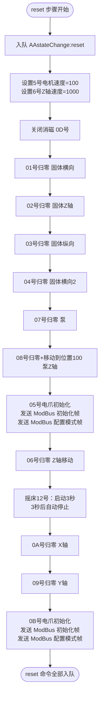

### 5.2 步骤二/五：xyzBackToOrigin（XYZ 回原点）

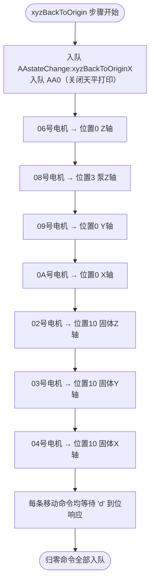

### 5.3 步骤三：takeEmptyBottle（取空瓶）

```mermaid
flowchart TD
    A([takeEmptyBottle 步骤开始]) --> B[入队 AAstateChange:takeEmptyBottle]
    B --> C[查询 pan_EmptyBottlePosition\n找 drug_name 非空且 slot_index 最小的槽位]
    C --> D{找到空瓶槽位？}
    D -->|否| ERR[触发紧急暂停\n报错：找不到空瓶]
    D -->|是| E[计算目标坐标\n行=index÷列数，列=index%列数\n坐标=原点+行列×间距]

    E --> F["0A/09/06 电机移动到空瓶位置\n等待各电机到位"]
    F --> G[释放5号夹爪\n重新夹紧（确保初始状态）]
    G --> H[上移06 Z轴到零点附近]
    H --> I[11号夹爪张开→关闭]
    I --> J[移动到夹持区 gripArea]
    J --> K[调整电爪力矩后夹住玻璃瓶]

    K --> L[开盖子流程\n见 5.3.1]

    L --> M["06号 Z轴上移到高度 163687\n5号夹爪松开"]
    M --> N[移动到放瓶盖区域 固定坐标]
    N --> O[5号夹爪松开\n06 Z轴回零]
    O --> P[回到夹持区\n夹住玻璃瓶\n11号夹爪松开]
    P --> Q[上移后回到夹持区更低Z值 269680]
    Q --> R[5号夹爪夹住\n11号夹爪松开]
    R --> S[06 Z轴上移]
    S --> T[移动到天平区 balanceArea]
    T --> U[5号夹爪松开\n06 Z轴回零]
    U --> V([取空瓶命令全部入队])
```

### 5.4 步骤四：getSolid（取固体，含三阶段称重）

```mermaid
flowchart TD
    A([getSolid 步骤开始]) --> B[入队 AAstateChange:getSolid]
    B --> C["入队 AA1（打开天平打印）\n入队 AA2（天平去皮）"]
    C --> D[查询 SolidMaterialArea 表\n获取固体盘参数：原点坐标·间距·行列数·当前索引]
    D --> E{找到固体配置？}
    E -->|否| ERR[触发紧急暂停]
    E -->|是| F[计算固体槽位坐标\nX 方向反向 xReverse=true]

    F --> G[0A电机到位置100]
    G --> H[04/03/02 电机移动到固体位置 XYZ]
    H --> I[0D号电机打开电磁铁\n吸附固体粉末]
    I --> J[02号Z轴回零]
    J --> K[04/03电机移动到天平区 balanceAreaForSolid]
    K --> L["入队 AAsetExpectedWeight:目标质量mg\n自动计算三级阈值"]

    L --> M[第一阶段称重\n速度=动态计算 100-800\n取决于目标质量大小]
    M --> M1["入队 AAEnableWeightCheck\n启用天平暂停触发"]
    M1 --> M2[01号电机旋转\n等待天平触发第一阈值或电机停止]

    M2 --> N[第二阶段称重\n速度固定=100]
    N --> N1[入队 AAEnableWeightCheck]
    N1 --> N2[01号电机继续旋转\n等待第二阈值]

    N2 --> O[第三阶段称重\n速度固定=50]
    O --> O1[入队 AAEnableWeightCheck]
    O1 --> O2[01号电机继续旋转\n等待第三阈值]

    O2 --> P[01号电机最终停止]
    P --> Q[02号Z轴回零]
    Q --> R[04/03电机回到原固体位置]
    R --> S[0D号关闭电磁铁\n释放粉末]
    S --> T[崴脚大法：04/03微调位置\n确保粉末完全分离]
    T --> U[02号Z轴回零]
    U --> V["入队 AA0（关闭天平打印）"]
    V --> W([取固体命令全部入队])
```

### 5.5 步骤六：getLiquid（取液体）

```mermaid
flowchart TD
    A([getLiquid 步骤开始]) --> B[入队 AAstateChange:getLiquid]
    B --> C[查询 pan_LiquidPosition\n找对应液体的槽位下标]
    C --> D{找到液体槽位？}
    D -->|否| ERR[触发紧急暂停]
    D -->|是| E[计算液体槽位坐标]

    E --> F[0A/09/06 电机移动到液体位置]
    F --> G[05号夹爪夹住液体瓶\n上移]
    G --> H[11号夹爪张开]
    H --> I[移动到夹持区 gripArea]
    I --> J[11号夹爪夹住液体瓶]
    J --> K[开盖子流程]

    K --> L[上移后移动到 Tips 头区域]
    L --> M[查询 tipsHeadUsage 表\n找 status=1 的记录（优先最小位置）]
    M --> N{找到可用 Tips？}
    N -->|否| N1{当前区已用完，切换另一区？}
    N1 -->|切换 currentIndex\n重置所有 status=1| M
    N1 -->|无可用区| ERR

    N -->|是| O[更新该 Tips 的 status+1]
    O --> P[入队 AAtipsHeadAreaCurrentIndexPlusOne:位置]
    P --> Q[08号Z轴下移到 Tips 位置 高度150000]
    Q --> R[08号Z轴上移回零]

    R --> S[移动到液体抽取区 gripLiquidArea]
    S --> T[07号泵：启用压力检测+液体探针]
    T --> U[07号泵吸液\n体积=volumeMl×1000 μL]
    U --> V[08号Z轴上移]
    V --> W[移动到天平区 Tips 吸液位置\n天平区+特定偏移]
    W --> X[07号泵分配液体]
    X --> Y[08号Z轴上移]
    Y --> Z[移动到废弃区 wasteArea]
    Z --> AA[07号泵丢弃 Tips 头]
    AA --> AB[08号Z轴上移]
    AB --> AC[回到夹持区，下降]
    AC --> AD[关盖子流程]
    AD --> AE[11号夹爪松开，上移]
    AE --> AF[回到液体位置，下降]
    AF --> AG[05号夹爪松开]
    AG --> AH[上移回到夹持区]
    AH --> AI([取液体命令全部入队])
```

### 5.6 步骤七：capBottleAndTransferToShaker（盖盖并送摇床）

```mermaid
flowchart TD
    A([步骤七开始]) --> B[入队 AAstateChange:capBottleAndTransferToShaker]
    B --> C[移动到天平区 balanceArea]
    C --> D[05号夹爪夹住瓶子\n上移]
    D --> E[11号夹爪预先张开]
    E --> F[移动到夹持区 gripArea]
    F --> G[11号夹爪夹住瓶子]
    G --> H[05号夹爪释放]
    H --> I[上移后移动到帽子区域 hatArea]
    I --> J[05号夹爪夹住瓶盖\n上移]
    J --> K[回到夹持区，下降]
    K --> L[关盖子流程\n实际进行拧盖动作]

    L --> M[送入摇床子流程]
    M --> N[11号夹爪松开\n上移]
    N --> O[入队 AAcloseShakeBed\n关闭摇床准备接收瓶子]
    O --> P[查询 shakeBedArea\n找 isEmpty=1 的空床位]
    P --> Q{找到空床位？}
    Q -->|否| ERR[触发紧急暂停\n无空摇床位]
    Q -->|是| R[计算床位坐标]
    R --> S["更新该床位 isEmpty = isEmpty+1\n即 1→2（标记占位）"]
    S --> T[0A/09/06 电机移动到摇床位置]
    T --> U[05号夹爪松开\n上移]
    U --> V[入队 AAopenShakeBed\n启动摇床]
    V --> W["入队 AArecordShakeBedTime:位置:15\n记录摇床15秒"]
    W --> X([步骤七命令全部入队])
```

---

## 第六章：天平称重系统

### 6.1 天平数据处理完整流程

```mermaid
flowchart TD
    A([天平TCP推送数据]) --> B["正则提取浮点数\n如 '22.1074 g' → 22.1074"]
    B --> C{解析成功？}
    C -->|否| Z([丢弃，等待下一包数据])
    C -->|是| D[计算当前目标阈值\n找第一个未触发的阈值]
    D --> E["发出 balanceWeightReceived 信号\n参数：当前重量·目标阈值·期望总重\n供状态栏实时显示"]

    E --> F{g_isWeightPauseActive = true？\n即称重检测已启用？}
    F -->|否| Z
    F -->|是| G{g_expectedWeight != 0？\n即已设置目标重量？}
    G -->|否| Z
    G -->|是| H[加锁 g_weightCheckMutex]
    H --> I[检查阈值0]
    I --> J{当前重量 >= 阈值0\n且阈值0未触发？}
    J -->|是| K[标记阈值0已触发\n发出 weightReached 信号\ng_isWeightPauseActive=false]
    J -->|否| L[检查阈值1]
    L --> M{当前重量 >= 阈值1\n且阈值1未触发？}
    M -->|是| N[标记阈值1已触发\n发出 weightReached 信号\ng_isWeightPauseActive=false]
    M -->|否| O[检查阈值2]
    O --> P{当前重量 >= 阈值2\n且阈值2未触发？}
    P -->|是| Q[标记阈值2已触发\n发出 weightReached 信号\ng_isWeightPauseActive=false]
    P -->|否| R([解锁，等待下一次])
    K --> R
    N --> R
    Q --> R
```

### 6.2 三级阈值计算（三档区间）

```mermaid
flowchart TD
    A([收到 AAsetExpectedWeight:W]) --> B{W < 0.0003mg？}
    B -->|是| C[强制修正为 0.0003mg\n输出警告]
    B -->|否| D[g_expectedWeight = W]
    C --> D
    D --> E[清空全部阈值和触发标记]

    E --> F{W 落在哪个区间？}

    F -->|W ≤ 0.0005mg\n超小量| G["阈值0 = W - 0.0002\n阈值1 = W - 0.0002\n阈值2 = W\n注：阈值0和阈值1相同"]

    F -->|0.0005 < W ≤ 0.0110mg\n小量| H["阈值0 = W - 0.0018\n阈值1 = W - 0.0003\n阈值2 = W"]

    F -->|W > 0.0110mg\n常规量| I["阈值0 = W - 0.0050\n阈值1 = W - 0.0010\n阈值2 = W"]

    G --> J([阈值设置完毕，等待天平数据])
    H --> J
    I --> J
```

### 6.3 称重检测启用时机

```mermaid
flowchart LR
    A[g_isWeightPauseActive = false\n默认关闭] -->|"队列处理到 AAsetExpectedWeight:W\n设置目标重量和阈值"| B[已设置目标，但检测仍关闭]
    B -->|"队列处理到 AAEnableWeightCheck\ng_isWeightPauseActive=true"| C[称重检测开启]
    C -->|"天平数据到达任一阈值时\ng_isWeightPauseActive=false"| D[检测自动关闭\n等待下一次 AAEnableWeightCheck]
    C -->|"队列处理到 AA0\n关闭天平打印"| A
```

### 6.4 天平阈值触发与队列暂停联动

```mermaid
sequenceDiagram
    participant Q as 命令队列
    participant TCP as TCP核心
    participant BAL as 天平TCP
    participant MW as 主窗口

    Q->>TCP: AAsetExpectedWeight:100.0
    TCP->>TCP: 计算3级阈值\n95.0 / 99.0 / 100.0
    Q->>TCP: AAEnableWeightCheck
    TCP->>TCP: g_isWeightPauseActive=true
    Q->>TCP: 01号电机旋转命令（第一阶段）

    BAL->>TCP: 推送重量数据 95.1mg
    TCP->>TCP: 95.1 >= 95.0 → 阈值0触发\ng_isWeightPauseActive=false
    TCP->>MW: 发出 weightReached(95.1) 信号

    MW->>TCP: pauseQueue() 暂停队列
    MW->>BAL: 发送去皮命令
    Note over MW: 等待 10 秒
    MW->>TCP: resumeQueue() 恢复队列

    Q->>TCP: AAEnableWeightCheck（第二阶段）
    TCP->>TCP: g_isWeightPauseActive=true
    Q->>TCP: 01号电机继续旋转（速度降低）

    BAL->>TCP: 推送重量数据 99.2mg
    TCP->>TCP: 99.2 >= 99.0 → 阈值1触发
    TCP->>MW: 发出 weightReached(99.2) 信号
    MW->>TCP: pauseQueue()
    Note over MW: 等待 10 秒
    MW->>TCP: resumeQueue()

    Q->>TCP: AAEnableWeightCheck（第三阶段）
    Q->>TCP: 01号电机精细旋转（速度最低）
    BAL->>TCP: 推送重量数据 100.0mg
    TCP->>TCP: 100.0 >= 100.0 → 阈值2触发
    TCP->>MW: 发出 weightReached(100.0)
    MW->>TCP: pauseQueue() 最终停止
```

---

## 第七章：AA 内部命令系统（共 18 条）

```mermaid
flowchart TD
    A([队列处理到 AA 前缀命令]) --> B{命令类型}

    B -->|AA0| C["关闭天平打印\n清空所有阈值和触发标记\n发出 balancePrintOffRequested"]
    B -->|AA1| D["开启天平打印\n发出 balancePrintOnRequested"]
    B -->|AA2| E["天平去皮\n发出 balanceTareRequested"]
    B -->|AAEnableWeightCheck| F["g_isWeightPauseActive = true\n启用称重检测"]

    B -->|AAsetExpectedWeight:W| G["计算三级阈值\n见第六章 6.2\n发出 setExpectedWeightRequested"]

    B -->|AAopenShakeBed| H["发出 openShakeBedRequested\n主窗口控制摇床启动"]
    B -->|AAcloseShakeBed| I["发出 closeShakeBedRequested\n主窗口控制摇床停止"]
    B -->|AAshakeBedForSeconds:N| J["发出 shakeBedForSecondsRequested(N)\n主窗口：启动摇床→N秒后停止"]

    B -->|AArecordShakeBedTime:loc:sec| K["发出 recordShakeBedTimeRequested\n主窗口写入数据库：\nstartTime=now endTime=now+sec\nisEmpty+1"]

    B -->|AAsetRecipeProcessState:state| L["发出 recipeProcessStateChangeRequested\n更新内存中配方状态"]

    B -->|AAallDevicesInitialized| M["发出 allDevicesInitializedRequested\n主窗口：m_allDevicesInitialized=true\n启动摇床为空检查定时器"]

    B -->|AAemptyBottleAreaCurrentIndexPlusOne| N["发出信号\n主窗口：incrementDatabaseField\n空瓶区 currentIndex+1"]

    B -->|AAtipsHeadAreaCurrentIndexPlusOne:loc| O["发出信号\n主窗口：\n更新该 Tips 使用记录 status+1\n若已用95次→切换区域·重置"]

    B -->|AAleaveTheShaker:loc| P["发出 leaveTheShakerRequested(loc)\n主窗口：UPDATE shakeBedArea\n该位置 isEmpty=1 清空时间"]

    B -->|AAskipStep:stepName| Q["发出 stepSkipped(stepName)\nm_isSkippingStep=true\nm_currentSkippingStep=stepName"]

    B -->|AAstateChange:stateName| R["发出 processStateChanged(stateName)\n主窗口更新步骤颜色显示\n若在跳过模式中且步骤切换→退出跳过"]

    B -->|AAstartTimer:name| S["记录开始时间到 m_timerStartTimes\[name\]"]
    B -->|AAendTimer:name| T["计算耗时 = now - startTime\n输出计时结果日志"]

    C & D & E & F & G & H & I & J & K & L & M & N & O & P & Q & R & S & T --> END["m_isProcessingQueue=false\n投递下一条处理"]
```

---

## 第八章：紧急暂停与恢复

### 8.1 紧急暂停的 4 种触发路径

```mermaid
flowchart TD
    T1["触发路径①\n用户点击紧急暂停按钮"]
    T2["触发路径②\n电机超时失败\nresponseTimeoutFailed 信号"]
    T3["触发路径③\n关键查询返回空\n如找不到空瓶/空摇床位"]
    T4["触发路径④\n异常捕获\ncatch 语句中调用"]

    T1 & T2 & T3 & T4 --> STOP["统一入口\nonEmergencyStopButtonClicked"]
    STOP --> 见下方流程
```

### 8.2 暂停后的完整分支流程

```mermaid
flowchart TD
    A([触发紧急暂停]) --> B{当前状态\nm_isEmergencyPaused？}

    B -->|false 运行中| C["调用 tcpCore.pauseQueue()\n软暂停队列"]
    C --> D["发送硬停命令给6台电机\n02·03·04·06·09·0A\n命令：设备号+K"]
    D --> E[设置 m_isEmergencyPaused=true]
    E --> F["更新按钮文字：继续运行\n按钮颜色变绿"]
    F --> G[弹出对话框\n选择操作]
    G --> H{用户选择？}

    H -->|仅暂停| I[保持暂停状态\n等待用户点击继续]
    H -->|放弃当前配方| J[清空 TCP 命令队列]
    J --> K["UPDATE recipeQueue\nSET processState=8\nWHERE processState=1"]
    K --> L["调用 loadAndExecuteNextRecipeFromDatabase\n预载下一条待处理配方\n但不自动启动执行"]
    L --> I

    I --> M([等待用户点击继续运行])

    B -->|true 暂停中| N["调用 tcpCore.resumeQueue()\n恢复队列处理"]
    N --> O[设置 m_isEmergencyPaused=false]
    O --> P["更新按钮文字：紧急暂停\n按钮颜色变红"]
    P --> Q([从中断位置继续执行])
```

### 8.3 右键取消单个步骤

```mermaid
flowchart TD
    A([用户右键点击某步骤复选框]) --> B{当前正在执行中？\nm_isProcessingQueue=true}
    B -->|否| Z([弹出菜单但操作无效])
    B -->|是| C{该步骤已被跳过？}
    C -->|是| Z
    C -->|否| D[弹出上下文菜单\n「取消此步骤」]
    D --> E{用户确认？}
    E -->|取消| Z
    E -->|确认| F[将步骤加入 m_skippedSteps]
    F --> G[向 TCP队列 发送 AAskipStep:步骤名]
    G --> H[更新UI：该步骤显示灰色+删除线]
    H --> I[禁用该复选框]
    I --> J([该步骤后续命令将被跳过])
```

---

## 第九章：摇床管理

### 9.1 摇床 isEmpty 四状态机

```mermaid
stateDiagram-v2
    [*] --> 空闲: isEmpty = 1\n初始状态

    空闲 --> 占位: isEmpty = 2\ntransferToShaker 选中此位置\nUPDATE isEmpty = isEmpty+1

    占位 --> 运行中: isEmpty = 3\nrecordShakeBedTime 命令执行\nUPDATE isEmpty = isEmpty+1\n写入 startTime endTime

    运行中 --> 待取出: isEmpty = 4\n每10秒检查：endTime <= now\nUPDATE isEmpty = isEmpty+1

    待取出 --> 空闲: isEmpty = 1\n机械臂取出成品放到成品区\nUPDATE isEmpty = 1\n清空 startTime endTime

    占位 --> 空闲: isEmpty = 1\n开机中断检测发现此状态\nUPDATE isEmpty = 1（恢复）
```

### 9.2 摇床定时检查流程（每 1 秒）

```mermaid
flowchart TD
    A([定时器④每 1 秒触发]) --> B["查询 shakeBedArea\nWHERE isEmpty = 3（运行中）"]
    B --> C{有运行中的摇床位？}
    C -->|否| Z([本次检查结束])
    C -->|是| D[遍历所有运行中记录]
    D --> E{endTime <= 当前时间？}
    E -->|否，未到时| F[跳过此记录]
    F --> D
    E -->|是，已到期| G["UPDATE shakeBedArea\nSET isEmpty=4\nWHERE selfLocation=X"]
    G --> H[机械臂移动到摇床位置\n取出成品瓶子]
    H --> I[移动到成品区\n放置瓶子]
    I --> J["UPDATE shakeBedArea\nSET isEmpty=1\n清空 startTime endTime"]
    J --> D
```

### 9.3 摇床为空自动停止（每 10 秒）

```mermaid
flowchart TD
    A([定时器⑤每 10 秒触发]) --> B["查询 shakeBedArea\n所有记录的 isEmpty 值"]
    B --> C{所有 isEmpty 都等于 1？}
    C -->|否，仍有占用| Z([本次检查结束，摇床继续运行])
    C -->|是，全部空闲| D[发送停止摇床命令\n0C号设备停止]
    D --> E([摇床电机停止])
```

---

## 第十章：配方完成与循环加载

### 10.1 配方完成后的自动流转

```mermaid
sequenceDiagram
    participant TCP as TCP核心
    participant MW as 主窗口
    participant DB as 数据库

    TCP->>MW: 发出 messageQueueEmpty 信号\n（当前配方所有命令执行完毕）

    MW->>DB: UPDATE recipeQueue\nSET processState=2\nWHERE processState=1
    Note over DB: 当前配方标记为已完成

    MW->>DB: SELECT * FROM recipeQueue\nWHERE processState=1
    Note over DB: 检查是否有其他正在执行的配方

    alt 有其他配方正在执行
        DB-->>MW: 返回结果
        MW->>MW: 不加载新配方\n等待
    else 无正在执行的配方
        DB-->>MW: 空结果

        MW->>DB: SELECT * FROM recipeQueue\nWHERE processState=0\nORDER BY createTime LIMIT 1
        Note over DB: 查找下一条待处理配方

        alt 找到待处理配方
            DB-->>MW: 返回配方记录

            MW->>MW: 重置流程状态显示\n所有步骤变灰

            MW->>DB: UPDATE recipeQueue\nSET processState=1\nWHERE id=X

            MW->>DB: SELECT * FROM recipeMessageQueue\nWHERE recipeId=X ORDER BY seq

            DB-->>MW: 返回所有命令记录

            MW->>TCP: 清空当前队列\n逐条导入新配方命令

            TCP->>TCP: 开始执行新配方
        else 无待处理配方
            MW->>MW: 输出日志：没有更多待执行的配方\n等待用户提交新配方
        end
    end
```

### 10.2 数据库状态更新时机汇总

```mermaid
flowchart TD
    A([系统运行中]) --> E1
    A --> E2
    A --> E3
    A --> E4
    A --> E5
    A --> E6
    A --> E7
    A --> E8

    E1["用户提交配方\n→ INSERT recipeQueue processState=0"]
    E2["开始执行配方\n→ UPDATE processState=1"]
    E3["配方执行完毕\n（messageQueueEmpty 信号）\n→ UPDATE processState=2"]
    E4["用户放弃配方\n（紧急暂停→放弃）\n→ UPDATE processState=8"]
    E5["程序重启检测遗留配方\n→ UPDATE processState=9"]
    E6["摇床开始运行\n（AArecordShakeBedTime）\n→ UPDATE shakeBedArea\nstartTime endTime isEmpty+1"]
    E7["摇床到期\n→ UPDATE isEmpty+1 → 4"]
    E8["成品取出\n→ UPDATE isEmpty=1\n清空时间字段"]
```

---

## 第十一章：数据库结构速览

```mermaid
graph LR
    subgraph 配方相关
        RQ["recipeQueue\n─────────\nid\nrecipeName\nprocessState 0/1/2/8/9\ncreateTime"]
        RMQ["recipeMessageQueue\n─────────\nrecipeId\nseq\ncontent\nasciiOrHex\nshouldWait\nexpectedSignature"]
    end

    subgraph 摇床相关
        SBA["shakeBedArea\n─────────\nselfLocation\nisEmpty 1/2/3/4\nstartTime\nendTime"]
    end

    subgraph 位置配置
        PI["pan_init\n─────────\nname 区域名称\nx y 起始坐标\ngripperZ\nrightSpacing\nbottomSpacing\ncols rows"]
        PEP["pan_EmptyBottlePosition\n─────────\nslot_index 0-14\ndrug_name\nvalue"]
        PLP["pan_LiquidPosition\n─────────\nslot_index 0-14\ndrug_name\nvalue"]
        PFP["pan_FinishedProductLocation\n─────────\nslot_index 0-14\ndrug_name\nvalue"]
    end

    subgraph 其他配置
        OT["other\n─────────\nname\noriginX originY\ngripperZ\nrightSpacing bottomSpacing\ncols rows\ncurrentIndex"]
        TH["tipsHeadUsage\n─────────\nselfLocation\nstatus 1=可用 2+=已用"]
    end

    RQ -->|"recipeId 关联"| RMQ
    PI -->|"区域名称对应"| SBA
    PI -->|"区域名称对应"| PEP
    PI -->|"区域名称对应"| PLP
    PI -->|"区域名称对应"| PFP
```

---

## 附录：信号槽快速映射表

| 发出信号的对象 | 信号 | 接收槽 | 动作 |
|--------------|------|--------|------|
| TCP天平 | balanceWeightReceived | 主窗口 | 更新状态栏重量显示 |
| TCP天平 | weightReached | 主窗口 | pauseQueue + 去皮 + 10s后resumeQueue |
| TCP主控 | balancePrintOffRequested | TCP天平 | 断开称重数据接收 |
| TCP主控 | balancePrintOnRequested | TCP天平 | 连接称重数据接收 |
| TCP主控 | balanceTareRequested | TCP天平 | 发送去皮命令 |
| TCP主控 | setExpectedWeightRequested | TCP天平 | 设置期望重量 |
| TCP主控 | recordShakeBedTimeRequested | 主窗口 | 写摇床数据库记录 |
| TCP主控 | processStateChanged | 主窗口 | 更新步骤颜色显示 |
| TCP主控 | openShakeBedRequested | 主窗口 | 发送摇床启动命令 |
| TCP主控 | closeShakeBedRequested | 主窗口 | 发送摇床停止命令 |
| TCP主控 | leaveTheShakerRequested | 主窗口 | UPDATE shakeBedArea isEmpty=1 |
| TCP主控 | responseTimeoutFailed | 主窗口 | 触发紧急暂停按钮 |
| TCP主控 | messageQueueEmpty | 主窗口 | 配方完成+加载下一条 |
| TCP主控 | stepSkipped | 主窗口 | 更新步骤显示为删除线 |
| TCP主控 | allDevicesInitializedRequested | 主窗口 | 启动摇床为空检查定时器 |
| 紧急停止按钮 | clicked | 主窗口 | onEmergencyStopButtonClicked |

---

## 附录：BoxData.ini 配置字段一览

| 配置组 | 字段 | 默认值 | 说明 |
|--------|------|--------|------|
| [TCP] | localIP | 192.168.5.27 | 本机 IP |
| [TCP] | tcpCoreRemoteIP | 192.168.5.201 | 主控设备 IP |
| [TCP] | tcpCoreRemotePort | 4196 | 主控端口 |
| [TCP] | tcpBalanceRemoteIP | 192.168.5.201 | 天平设备 IP |
| [TCP] | tcpBalanceRemotePort | 4197 | 天平端口 |
| [Database] | host | 192.168.10.170 | MySQL 地址 |
| [Database] | port | 3306 | MySQL 端口 |
| [Database] | database | PhenoLabHT | 数据库名 |
| [Database] | user | root | 用户名 |
| [Database] | password | Zq17122320_ | 密码 |
| [Process-Steps] | reset | true | 步骤勾选状态 |
| [Process-Steps] | xyzBackToOrigin1 | true | 步骤勾选状态 |
| [Process-Steps] | takeEmptyBottle | true | 步骤勾选状态 |
| [Process-Steps] | getSolid | false | 步骤勾选状态 |
| [Process-Steps] | xyzBackToOrigin2 | true | 步骤勾选状态 |
| [Process-Steps] | getLiquid | true | 步骤勾选状态 |
| [Process-Steps] | capBottleAndTransferToShaker | true | 步骤勾选状态 |
